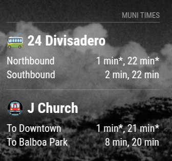

# MMM-MuniTimes

A [MagicMirror²](https://github.com/MichMich/MagicMirror) module to display arrival times for San Francisco Muni transit stops.



## Features

- Display real-time arrival predictions for SF Muni buses, trains, and cable cars
- Support for multiple stops
- Customizable display options
- Special icons for different vehicle types
- Multiple time formats
- Grouping by line option for cleaner display
- Error handling with automatic retries

## Installation

1. Navigate to your MagicMirror's `modules` folder:

```bash
cd ~/MagicMirror/modules/
```

2. Clone this repository:

```bash
git clone https://github.com/narrowstacks/MMM-MuniTimes.git
```

3. Install dependencies:

```bash
cd MMM-MuniTimes
npm install
```

4. Add the module to your MagicMirror config. See the configuration section below.

## Configuration

To use this module, add it to the modules array in the `config/config.js` file of your MagicMirror:

```javascript
modules: [
  {
    module: "MMM-MuniTimes",
    position: "top_right",
    header: "Muni Times",
    config: {
      apiKey: "YOUR_511_API_KEY", // Get from https://511.org/developers/
      stops: [
        {
          stopCode: "13543",
          stopName: "30th St & Church St",
          direction: "Northbound",
          lineNames: { 24: "24 Divisadero" },
        },
        {
          stopCode: "13538",
          stopName: "30th St & Church St",
          direction: "Southbound",
          lineNames: { 24: "24 Divisadero" },
        },
        {
          stopCode: "14000",
          stopName: "30th St & Church St",
          direction: "To Downtown",
          lineNames: { J: "J Church" },
        },
        {
          stopCode: "14004",
          stopName: "30th St & Church St",
          direction: "To Balboa Park",
          lineNames: { J: "J Church" },
        },
      ],
      agency: "SF", // Default: SF (for San Francisco Muni)
      updateInterval: 60000, // Update every 60 seconds
      maxResults: 2, // Show next 2 arrivals per stop
      showEmptyLines: true, // Show "No arrivals" when no data
      showLineIcons: true, // Show owl/express icons
      showStopNames: true, // Show stop names in the UI
      timeFormat: "minutes", // Time format (minutes, verbose, or full)
      timeZone: "America/Los_Angeles", // Timezone for displaying times
      groupByLine: true, // Option to group arrivals by line instead of stop
    },
  },
];
```

### Required configuration options

| Option   | Description                                                                         |
| -------- | ----------------------------------------------------------------------------------- |
| `apiKey` | Your 511.org API key. Get it from [511.org/developers](https://511.org/developers/) |
| `stops`  | Array of stop configurations (see below)                                            |

### Stop configuration

Each stop in the `stops` array can have the following properties:

| Property           | Description                                 | Required |
| ------------------ | ------------------------------------------- | -------- |
| `stopCode`         | The Muni stop ID                            | Yes      |
| `stopName`         | A custom name for this stop                 | No       |
| `direction`        | Direction of the stop (e.g., "Northbound")  | No       |
| `lineNames`        | Object mapping line IDs to custom names     | No       |
| `destinationNames` | Object mapping destinations to custom names | No       |

Example stop configuration:

```javascript
{
  stopCode: "13543",
  stopName: "30th St & Church St",
  direction: "Northbound",
  lineNames: {
    "24": "24 Divisadero"
  },
  destinationNames: {
    "Outbound to La Playa": "To Ocean Beach",
    "Inbound to Embarcadero": "To Downtown"
  }
}
```

### Optional configuration options

| Option           | Description                                                                 | Default                 |
| ---------------- | --------------------------------------------------------------------------- | ----------------------- |
| `agency`         | Transit agency code                                                         | `"SF"`                  |
| `updateInterval` | How often to fetch new data (in milliseconds)                               | `60000`                 |
| `maxResults`     | Maximum number of arrivals to display per stop                              | `2`                     |
| `showEmptyLines` | Whether to show "No arrivals" message                                       | `true`                  |
| `showLineIcons`  | Show emojis for different transit types, and owl and express services       | `true`                  |
| `showStopNames`  | Show stop names in the display                                              | `true`                  |
| `timeFormat`     | Format for displaying arrival times (`"minutes"`, `"verbose"`, or `"full"`) | `"minutes"`             |
| `timeZone`       | Time zone used for displaying times in `"full"` format                      | `"America/Los_Angeles"` |
| `groupByLine`    | Group arrivals by line instead of by stop                                   | `true`                  |
| `retryDelay`     | Delay before retrying after an error (in milliseconds)                      | `10000`                 |
| `maxRetries`     | Maximum number of consecutive retries after an error                        | `3`                     |

### Time Format Options

The module supports three different time formats:

1. **minutes** - Shows minutes until arrival (e.g., "5 min")
2. **verbose** - Shows time until arrival in a descriptive format (e.g., "5 minutes, 30 seconds")
3. **full** - Shows the actual arrival time in local time (e.g., "8:45 PM PDT")

## Finding Your Stop Code

You can find your stop code by:

1. Visiting the [SFMTA website](https://www.sfmta.com/getting-around/muni/routes-stops)
2. Finding your stop on Google Maps (the stop code is often in the stop name)
3. Looking at the bus stop sign which usually displays the stop ID

## Special Indicators

The module shows special indicators for certain types of service:

- 🚎 Trolleybus - Electric trolleybus routes
- 🚌 Bus - Regular motorbus routes
- 🚟 Cable Car - Cable car routes
- 🚇 Metro/Streetcar - Light rail/streetcar routes
- 🦉 Owl service (late night) - Line 91 or lines with "OWL" in the name
- 🚀 Express service - Lines with "R" in the name

## Notes

- This module requires an internet connection to fetch real-time arrival data.
- API requests are limited based on your 511.org API key quota.

## License

MIT
